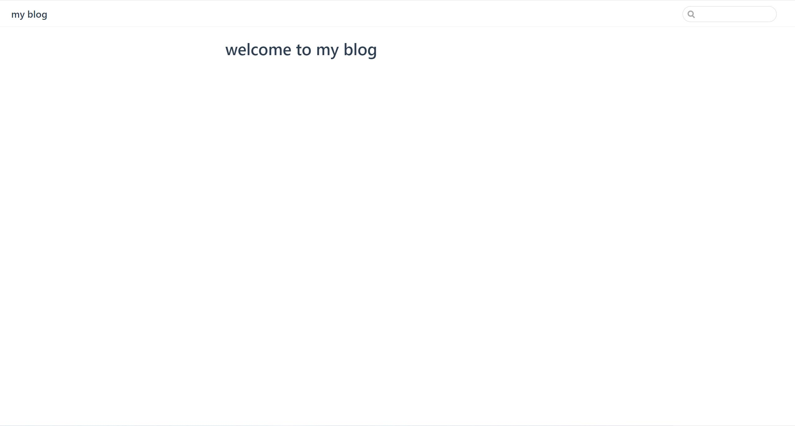

### 创建项目

创建并进入文件目录

```
// 你可以在这里自定义你自己的项目文件名称
mkdir Lee'sBlog && cd Lee'sBlog
```

### 项目初始化

```
// 使用npm
npm init
// 使用yarn
yarn init
```

### 安装依赖

```
// 使用npm
npm install -D vuepress
// 使用yarn
yarn add -D vuepress
```

### 项目配置

配置项目文件目录

1.  在项目根目录下新建一个 docs 文件夹(相当于 vue 项目的 src), 然后创建 index.md 作为你博客首页展示的第一篇文档

```
mkdir docs && echo '# welcome to my blog' > docs/index.md
```

2.  在 docs 文件夹下新建 .vuepress 文件夹, 然后新建一个 config.js , 这将是你项目后续配置入口, 所有 vuepress 相关的配置、代码都会被放到这里

```
cd docs
mkdir .vuepress
```

3.  现在, 我们在 config.js 中配置网站的标题和描述,便于 SEO

```js
// 这里你可以随意描述你的博客
module.exports = {
  title: 'my blog',
  description: '使用vuepress开发的个人博客'
}
```

5. 在 package.json 中添加一些 scripts

```json
{
  "scripts": {
    "dev": "vuepress dev docs",
    "build": "vuepress build doc"
  }
}
```

### 搭建完成

现在, 本地搭建步骤就完成了, 你就可以启动你的项目

```
// 使用npm
npm run dev
// 使用yarn
yarn dev
```

### 成功预览

如果成功的话, 你的页面跑起来之后应该会是这个样子


