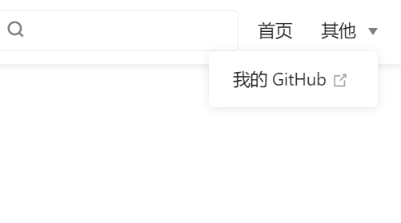
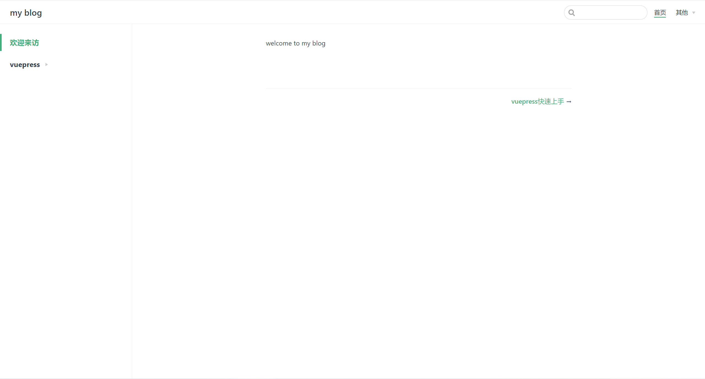

 搭建完项目的基本框架, 现在我们来进行一些简单的自定义修改

前面说过, 关于 vuepress 的所有配置和代码都会保存在 .vuepress 文件夹下, 所以如果要自定义修改, 我们要先来到 config.js 下, 进行如下配置

### 添加导航栏

```
module.exports = {
        // ...
        themeConfig: {
            nav: [
                { text: '首页', link: '/' },
                {
                    text: '其他',
                    items: [
                        { text: '我的 Github', link: 'https://github.com/lSpikeSpiegel' }
                    ]
                }
            ]
        }
}
```

效果如下



如果需要更详细的导航栏配置, 请参考 [vuepress 官方文档](https://www.vuepress.cn/config/)

### 添加侧边栏

参考导航栏, 添加侧边栏也需要修改 config.js 下的配置, 我们先对其做如下配置

```
    module.exports = {
            // ...
            themeConfig: {
                nav: [...],
                sidebar: [
                    {
                        title: '欢迎来访',
                        path: '/',
                    },
                    {
                        title: "vuepress",
                        path: '/studyNotes/vuepress/index',
                        collapsable: true, // 折叠
                        children: [
                            { title: "vuepress快速上手", path: "/studyNotes/vuepress/01vuepress快速上手" },
                            { title: "进行一些简单的自定义修改", path: "/studyNotes/vuepress/10进行一些简单的自定义修改" }
                        ],
                    }
                ]
            }
    }
```

### 修改文件目录

修改了 config.js 之后我们需要修改项目文件目录使其与配置文件的路径相匹配, 参考我们 config.js 中的配置, 我们需要将项目文件目录修改为如下所示

```
    .
    ├─ docs
    │ ├─ index.md
    │ └─ .vuepress
    │    └─ config.js
    | └─ studyNotes
    |    └─ vuepress
    |       ├─ index.md
    |       ├─ 01vuepress快速上手.md
    |       └─ 10进行一些简单的自定义修改.md
    └─ package.json
```

### 成功预览

完成上述配置之后, 再次启动你的项目, 它现在应该会是这个样子, 当然文章内容需要你自行写入

