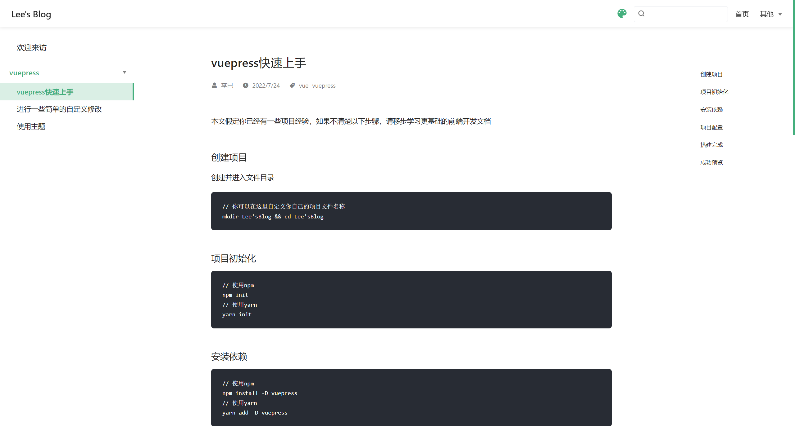

### 本节前言

到目前为止, 我们已经完成了一个个人博客基本框架的搭建, 实现了导航、目录和内容展示功能, 但是网页整体看起来还是比较简陋, 并且缺少一些常见的效果, 比如 loading、过度动画、主题切换等, 你可以自己开发相关功能, 但是为了减少开发和学习成本, 我们可以直接使用 vuepress 的主题库来实现这些;

在本次项目中, 我们使用 vuepress-theme-reco 主题

### 安装主题

```
// npm安装
npm install vuepress-theme-reco --save-dev
// yarn安装
yarn add vuepress-theme-reco
```

### 配置 config.js

```
module.exports = {
    // ...
    theme:'reco' // 配置文档主题,
    locales: {  // 配置语言设置, vuepress 默认的 lang 是 en-US , 我个人喜欢把它修改为 zh-CN
        '/': {
        lang: 'zh-CN'
        }
    },
    themeConfig: {
        // ...
        subSidebar: 'auto' // 自动生成右侧子侧边栏
    }
}
```

### 添加文档信息

此时, 我们便可以在文档中添加一下其他信息, 比如

```
---
title: README
author: 李巳
date: '2022-07-24'
categories:
  - frontEnd
tags:
  - vue
  - vuepress
---
```

### 成功预览

最后, 我们再次启动项目, 会发现我们本节开头提到的一些功能现在都有了, 你的页面应该会长这样
