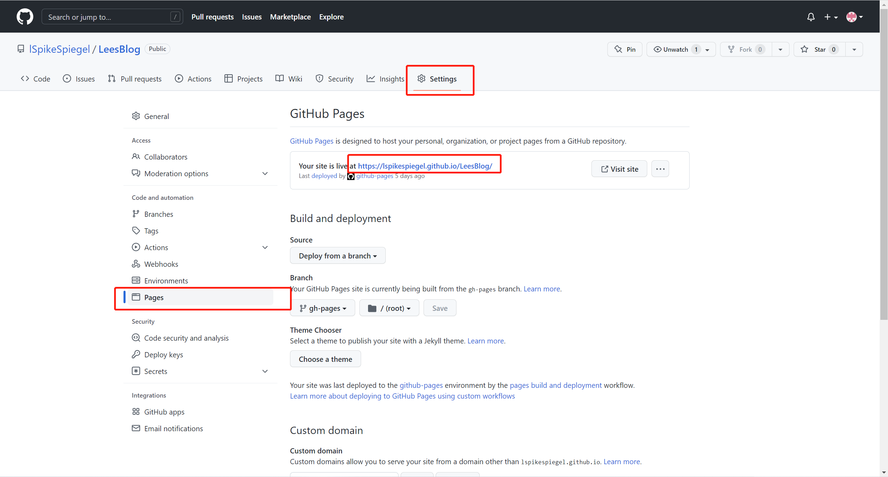

### 本节前言

完成了博客的基础搭建之后, 我们的最后一步, 当然就是部署了, 这里我们部署到免费的 Github Pages 上;

### 配置 config.js

```js
module.exports = {
    // ...
    base: '/LeesBlog/', // 这里应该是你个人项目对应的github仓库地址
    // ...
}
```

### 配置部署文件

然后我们在项目的根目录下, 创建一个脚本文件: deploy.sh , 对其做如下配置

```sh

#!/usr/bin/env sh

# 确保脚本抛出遇到的错误
set -e

# 生成静态文件
npm run build

# 进入生成的文件夹
cd docs/.vuepress/dist

git init
git add -A
git commit -m 'deploy'

# 这里的push的仓库地址, 就是仓库的克隆地址, 需要你自行做相应的更改
git push -f https://github.com/lSpikeSpiegel/LeesBlog.git master:gh-pages

cd -
```

### 项目部署

最后, 提交代码, 提交之后在项目根目录下, 使用 git bash 执行脚本文件(windows 系统的 cmd、powershell 均无法执行 sh 命令, 为了方便我们部署项目, 你可以在 git bash 下执行) sh deploy.sh. 此时项目就开始构建、打包完成之后就会推送到你个人项目的 ghpages 分支下, 在你的项目仓库 -> settings -> pages 下会展示出你的项目部署路径, 如下:


好了, 至此你已经完成了个人博客的搭建。